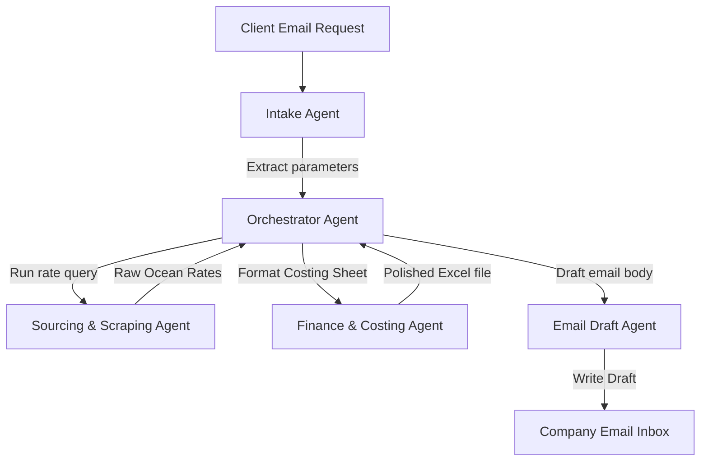

# Project Proposal: Multi-Agent Sourcing & Email Automation Workflow
**Prepared For**: Infreight Logistics Sourcing Team  
**Date**: 13 July 2026  

---

## 📋 Executive Summary
This document outlines the design and architecture of a **Multi-Agent AI Sourcing & Email Automation System**. The system automates the manual lifecycle of processing rate requests (RFQs)—from initial client emails, through rate querying and costing spreadsheet generation, to drafting the final email response.

By orchestrating multiple specialized AI Sub-Agents, this workflow eliminates administrative bottlenecking, ensures faster quote response times, and guarantees data accuracy.

---

## 🏗️ System Architecture & Workflow

The system operates via a network of specialized sub-agents governed by a central Orchestrator. 

### 👥 The 5 Agent Roles

#### 1. Intake Agent (Email Listener)
* **Access**: Connected to the company email inbox (via Gmail API or Microsoft Graph API).
* **Job**: Monitors the inbox for rate requests, parses email text/attachments, and extracts key search parameters:
  * Origin and Destination ports (UN/LOCODEs)
  * Container Type (e.g. 20GP, 40HQ) and Quantity
  * Target Shipment Dates (ETD/ETA)
  * Commodity & Cargo Weight
* **Output**: A standardized JSON Sourcing Request.

#### 2. Sourcing Orchestrator (The Coordinator)
* **Job**: Serves as the central brain. Receives requests from the Intake Agent, invokes the Scraping Agent, hands the raw rates to the Costing Agent, and passes the output to the Email Draft Agent.

#### 3. Sourcing & Scraping Agent (Rates Engine)
* **Job**: Drives our existing Playwright-based crawling engines (ONE, Hapag-Lloyd, OOCL, MSC, CMA CGM, Maersk, GreenX) to fetch direct ocean freight rates and transit schedules.
* **Output**: Raw quote data schemas.

#### 4. Finance & Costing Agent (Excel Compiler)
* **Job**: Takes the raw rates, applies custom markups, includes local origin/destination handling charges, and compiles a customer-ready costing spreadsheet.
* **Output**: A formatted Excel workbook (`costing_sheet.xlsx`) using corporate styling, calculations, and rate comparisons.

#### 5. Email Draft Agent (Communicator)
* **Job**: Generates a professional email draft summarizing the best quotes, attaches the Excel costing spreadsheet, and saves it directly in the company's email **Drafts folder** for human verification.

---

## 📊 Technical Data Flow

The step-by-step transaction details:

| Step | Component | Action Description | Technology |
|---|---|---|---|
| **1** | Email Intake | Listen to `sales@company.com` inbox for new RFQ keywords | Microsoft Graph API / Gmail API |
| **2** | LLM Parsing | Extract unstructured email text into structured rate criteria | Gemini 1.5 Pro |
| **3** | Rate Query | Trigger the automated carrier web crawlers | Playwright / FastAPI / SQLite |
| **4** | Costing | Apply target markup percentages and calculate final customer rates | Python `openpyxl` |
| **5** | Draft Creation | Write a structured, polite sales pitch with costing breakdown and save as Draft | IMAP / Graph API |

---

## 🛠️ Implementation Stages

### Phase 1: Email Integration (Week 1-2)
* Establish secure OAuth2 connections to the company email service.
* Write parser scripts using Gemini to turn emails into clean JSON parameters.

### Phase 2: Costing Excel Compiler (Week 2-3)
* Develop a spreadsheet template with brand colors, automated markup formulas, and comparison grids.
* Build the python script to fill rates into this spreadsheet.

### Phase 3: Agent Orchestration (Week 3-4)
* Connect all agents together under the FastAPI coordinator.
* Add a manual approval dashboard where users can see the drafted email and Excel sheet before pushing it to the client's inbox.
